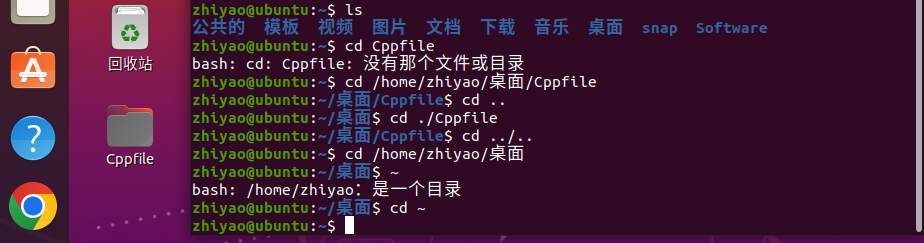
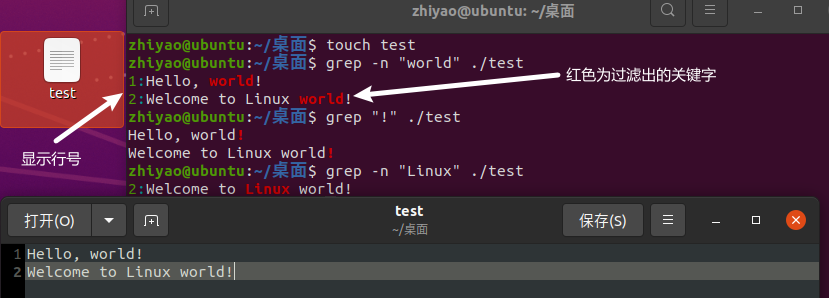

# Linux基础命令


## Linux的目录结构


- `/`，根目录是最顶级的目录了
- Linux只有一个顶级目录：`/`
- 路径描述的层次关系同样适用`/`来表示
- /home/itheima/a.txt，表示根目录下的home文件夹内有itheima文件夹，内有a.txt


## ls命令

功能：列出文件夹信息

语法：`ls [-l -h -a] [参数]`

- ls,查看当前工作目录下的内容，可以指定要查看的文件夹(目录)的内容，如果不给定参数，就查看当前工作目录的内容。

- 参数：被查看的文件夹，不提供参数，表示查看当前工作目录

- -l，以列表形式展示内容，并展示更多细节。
- -h，配合-l使用，以更加人性化的方式显示文件大小,如下图(4090--->4.0k)
- -a，显示隐藏文件


### 隐藏文件、文件夹

- 在Linux中以`.`开头的，均是隐藏的。

- 默认不显示出来，需要`-a`选项才可查看到。


语法中的选项是可以组合使用的，比如 -a 和 -l 。

-  以列表形式，显示工作目录下的所有文件。
  - ls -l -a
  - ls -la
  - ls -al
  - 上述三种写法，都表示同时应用哦‘ -l ’和‘ -a ’的功能。
  - ls -lah   等同于   ls -a -l -h  
  - 以列表形式、人性化的方式展示当前目录的所有隐藏内容。
  - ==其中首字符为`d`开头的为文件夹==， ==`-`开头的为文件==


### ls选项和参数的组合使用

- ls  -la  /  
- 其中 / 表示根目录，即显示根目录下隐藏的所有文件。


### ls的 -h 命令

- ls [-a -l -h]  [Linux路径]
- -h 表示以易于阅读的形式，列出文件大小，如K、M、G
- -h 选项，必须要搭配 -l 一起使用。


## pwd命令

功能：展示当前工作目录  ==P==rint ==W==ork ==D==irectory

语法：`pwd` 

- pwd命令， 无选项，无参数，直接输入即可。

通过ls来验证当前工作目录，其实是不妥的。可以通过pwd命令，来查看当前所在的工作目录。


## cd命令

功能：切换工作目录   ==C==hange ==D==irectory

语法：`cd [目标目录]`

- cd命令无需选项，只有参数，表示切换到指定路径。
- cd命令直接执行，不写参数，表示回到用户的HOME目录。

参数：目标目录，要切换去的地方，不提供默认切换到`当前登录用户HOME目录`

当Linux终端打开的时候，会默认以用户的HOME目录作为当前工作目录。


## HOME目录

每一个用户在Linux系统中都有自己的专属工作目录，称之为HOME目录。

- 普通用户的HOME目录，默认在：`/home/用户名`

- root用户的HOME目录，在：`/root`

FinalShell登陆终端后，默认的工作目录就是用户的HOME目录


## 相对路径、绝对路径

- 相对路径，以==根目录为起点==，==非==`/`开头的称之为相对路径

  相对路径表示以`当前目录`作为起点，去描述路径，如`test/a.txt`，表示当前工作目录内的test文件夹内的a.txt文件

- 绝对路径，以==当前目录为起点==，==以==`/`开头的称之为绝对路径

  绝对路径从`根`开始描述路径


## 特殊路径符

- `.`，表示当前目录，比如`cd ./Cppfile`，表示当前文件夹内的`Cppfile`文件，和cd Cppfile效果一致。
- `..`，表示上级目录，比如`cd ../`表示上级目录，`cd ../../`表示上级的上级目录
- `~`，表示用户的HOME目录，比如`cd ~`，即可切回用户HOME目录
- `cd ~/桌面`切换到HOME内的桌面目录。
- Tab 键可以补全路径名称。

如图，当前工作目录处于/home/zhiyao/桌面/Cppfile，现想上回退一级，切换到`/home/zhiyao/桌面`中，如何操作？退回到`/home/zhiyao`如何操作？




## mkdir命令

功能：创建文件夹      ==M==a==k==e ==Dir==ectory 

语法：`mkdir [-p] [Linux路径(参数)] `

- 参数：参数必填，即要创建的文件夹的路径，相对/绝对路径均可。
- 选项：-p，可选，表示自动创建不存在的父母录，创建前置路径


- 如果想要一次性创建多个层级目录，可以通 `-p` 选项，将一整个链条都创建完。


- 注意：创建文件夹需要修改权限，需确保操作均在HOME目录内，不要在HOME外操作。
- 如下图：在根目录下无法创建文件夹。


## touch命令

功能：创建文件 

语法：`touch  参数`

- 参数：被创建的文件路径
- touch命令无选项，参数必填，表示要创建的文件路径，相对、绝对、特殊路径符均可
- 蓝色为文件夹，白色为文件


## cat命令

功能：查看文件内容

语法：`cat 参数`

- 参数：被查看的文件路径
- 使用mkdir创建test.txt后，往里面写入“Hello，world！”再通过`cat`命令读取文件内容。


## more命令

功能：查看文件，可以支持翻页查看

语法：`more 参数`

- 参数：被查看的文件路径
- 没有选项，只有必填参数：文件路径
- cat是直接将内容全部显示出来，more支持翻页，若文件内容过多，可以一页页显示
- 在查看过程中：
  - `空格`键翻页
  - `q`退出查看

练习：Linux系统内置有一个文件，路径为：/etc/services,可以使用more命令查看。

`more/etc/services`  在查看过程中，通过==空格翻页==，或者==回车显示下一行==，如图：


## cp命令

功能：复制文件、文件夹    ==C==o==p==y

语法：`cp [-r] 参数1 参数2`

- 参数1，Linux路径，被复制的文件或文件夹
- 参数2，Linux路径，要复制去的地方
- 选项：-r，可选，复制文件夹使用，表示递归

示例：

- cp a.txt b.txt，复制当前目录下a.txt为b.txt
- cp a.txt test/，复制当前目录a.txt到test文件夹内
- cp -r test test2，复制文件夹test到当前文件夹内为test2存在


## mv命令

功能：移动文件、文件夹      ==m==o==v==e

语法：`mv 参数1 参数2`

- 参数1：Linux路径，被移动的
- 参数2：Linux路径，要移动去的地方，参数2如果不存在，则会进行改名


- 如图，移动转移到test、test2文件夹后，现桌面已没有a.txt、b.txt、test.txt文件


## rm命令

功能：删除文件、文件夹     ==r==e==m==ove

语法：`rm [-r -f] 参数...参数`

- 参数：支持多个，每一个表示被删除的，空格进行分隔
- 选项：-r，删除文件夹使用
- 选项：-f，表示==force==强制删除，不会给出确认提示，一般root用户会用到

> rm命令很危险，一定要注意，特别是切换到root用户(超级管理员)的时候。
>
> 如下命令：千万！！！不要在root管理员用户下执行
>
> - rm -rf /
>
> - rm -rf /*
>
> 效果等同于在Windows上执行C盘格式化

**rm删除文件、文件夹 - 通配符** 

rm命令支持通配符，用来做模糊匹配

- 符号 * 表示通配符，即匹配任意内容(包含空)，示例：
- test* ，表示匹配任何以test开头的内容
- *test，表示匹配任何以test结尾的内容
- `*test*`, 表示匹配任何包含test的内容


- 删除test结尾的文件：`rm *test`   文件删除成功


- 而文件夹需要使用-r选项：`rm -r test*`删除以test开头的文件夹。


演示强制删除， -f选项

- 可以通过`su - root`并输入账户密码，临时切换到root用户体验。

- 通过输入exit命令，退回普通用户。


## which命令


功能：查看命令的程序本体文件路径

语法：`which 参数`

- 参数：要查找的命令
- Linux命令，其本体就是一个个的二进制可执行程序，和Windows系统中的.exe文件一样。


## find命令

### 按文件名查找文件 

功能：搜索文件

语法1按文件名搜索：`find 路径 -name 参数`

- 路径：搜索的起始路径
- 参数：搜索的关键字，支持通配符*， 比如：`*`test表示搜索任意以test结尾的文件

被查找文件名，支持使用通配符 * 来做模糊查询。

- 符号*表示通配符，即匹配任意内容(包含空), 示例：
- test*，表示匹配任何以test开头的内容
- *test，表示匹配任何以test结尾的内容
- `*test*` 表示匹配任何包含test的内容


如上图表示： 查找`./`当前目录中，以test开头的文件。


### 按文件大小查找文件

语法：find   起始路径    -size   +|-n[kMG]

- |表示或，+、-表示大于和小于
- n表示大小数字
- KMG表示大小单位，k(小写)表示kb，M表示MB，G表示GB

> 示例：

- 查找根目录下==小于==10KB的文件： `find / -size -10k`
- 查找根目录下==大于==100MB的文件： `find / -size+100M`
- 查找根目录下==大于==1GB的文件：`find / -size+1G`
- 若`find  / -size` 后不加 **+ -** 号，可以查找指定大小的文件。如：`find / -size 1G`
- 可以配合`ls -lh`使用，查看文件大小。


如图：在桌面目录下的file目录中，查找小于10k的文件(包括文件夹+文件)。


## grep命令

功能：从文件中通过关键字过滤文件行

语法：`grep [-n] 关键字 文件路径`

- 选项-n，可选，表示在结果中显示匹配的行的行号。
- 参数，**关键字**，必填，表示过滤的关键字，带有空格或其它特殊符号，建议使用==**” ”**==将关键字包围起来
- 参数，**文件路径**，必填，表示要过滤内容的文件路径，==可作为管道符输入==

> 参数文件路径，可以作为管道符的输入




## wc命令

功能：统计文件的行数、单词数量等

语法：`wc [-c -m -l -w] 文件路径`

- 选项，-c，统计bytes数量
- 选项，-m，统计字符数量
- 选项，-l，统计行数
- 选项，-w，统计单词数量
- 参数，文件路径，被统计的文件，==可作为管道符输入==

> 参数文件路径，可作为管道符的输入

不加 [-c -m -l -w]选项，默认显示： 行数、单词数、字节数、文件名


分别显示各个选项


## 管道符|

写法：`|`

功能：将符号左边的结果，作为符号右边的输入(**内容源**)

示例：

- `cat test | grep test`，将cat test的结果，作为grep命令的输入(**内容源**)，用来过滤`Linux`关键字


可以支持嵌套：

- `cat test | grep world | grep Linux`


## echo命令

功能：输出内容

语法：`echo 参数`

- 参数：被输出的内容


## `反引号

功能：被两个反引号包围的内容，会作为命令执行

示例：

- echo \`pwd\`，会输出当前工作目录


## tail命令

功能：查看文件尾部内容

语法：`tail [-f] 参数`

- 参数：被查看的文件
- 选项：-f，持续跟踪文件修改


## head命令

功能：查看文件头部内容

语法：`head [-n] 参数`

- 参数：被查看的文件
- 选项：-n，查看的行数


## 重定向符

功能：将符号左边的结果，输出到右边指定的文件中去

- `>`，表示覆盖输出
- `>>`，表示追加输出


## vi编辑器

通过vi/vim命令编辑文件，会打开一个新的窗口，此时这个窗口就是：命令模式窗口

命令模式窗口是vi编辑器的入口和出口。

- 使用：`vim hello.txt`编辑一个新文件，执行后进入的是命令模式

- 在命令模式内，按键盘`i`进入输入模式

- 在输入模式内输入：`Hello, I'm Linux`

- 输入完成后，按`esc`会退回命令模式

- 在命令模式内，按键盘：`,`进入底线命令模式

- 在底线命令内输入：`wq`，保存文件并退出vi编辑器

  

### 命令模式快捷键


### 底线命令快捷键


## 命令的选项

我们学习的一系列Linux命令，它们所拥有的选项都是非常多的。

比如，简单的ls命令就有：-a -A -b -c -C -d -D -f -F -g -G -h -H -i -I -k -l -L -m -n -N -o -p -q -Q -r-R -s -S -t -T -u -U -v -w -x -X -1等选项，可以发现选项是极其多的。

课程中， 并不会将全部的选项都进行讲解，否则，一个ls命令就可能讲解2小时之久。

课程中，会对常见的选项进行讲解， 足够满足绝大多数的学习、工作场景。


### 查看命令的帮助

可以通过：`命令 --help`查看命令的帮助手册


### 查看命令的详细手册

可以通过：`man 命令`查看某命令的详细手册


# Linux常用操作

## 软件安装

- CentOS系统使用：
  - yum [install remove search] [-y] 软件名称
    - install 安装
    - remove 卸载
    - search 搜索
    - -y，自动确认
- Ubuntu系统使用
  - apt [install remove search] [-y] 软件名称
    - install 安装
    - remove 卸载
    - search 搜索
    - -y，自动确认

> yum 和 apt 均需要root权限


## systemctl

功能：控制系统服务的启动关闭等，控制软件的启动、关闭、开机自启动

- 系统内置服务均可被systemctl控制
- 第三方软件，如果自动注册了可以被systemctl控制
- 第三方软件，如果没有自动注册，可以手动注册

语法：`systemctl start | stop | restart | disable | enable | status 服务名`

- start，启动
- stop，停止
- status，查看状态
- disable，关闭开机自启
- enable，开启开机自启
- restart，重启


## 软链接

功能：创建文件、文件夹软链接（快捷方式），类似Windows中的快捷方式

语法：`ln -s 参数1 参数2`

- 参数1：被链接的文件或文件夹
- 参数2：要链接去的地方（快捷方式的名称和存放位置）

## 日期

语法：`date [-d] [+格式化字符串]`

- -d 按照给定的字符串显示日期，一般用于日期计算

- 格式化字符串：通过特定的字符串标记，来控制显示的日期格式
  - %Y   年%y   年份后两位数字 (00..99)
  - %m   月份 (01..12)
  - %d   日 (01..31)
  - %H   小时 (00..23)
  - %M   分钟 (00..59)
  - %S   秒 (00..60)
  - %s   自 1970-01-01 00:00:00 UTC 到现在的秒数


示例：

- 按照2022-01-01的格式显示日期

  

- 按照2022-01-01 10:00:00的格式显示日期

  

- -d选项日期计算

  

  - 支持的时间标记为：

    


## 时区

修改时区为中国时区


> `timedatectl list-timezones`

> `sudo timedatectl set-timezone Asia/Shanghai`


修改成功

## ntp

功能：同步时间

安装：`yum install -y ntp`

启动管理：`systemctl start | stop | restart | status | disable | enable ntpd`


手动校准时间：`ntpdate -u ntp.aliyun.com`


## ip地址

ip地址是联网计算机的网络地址，用于在网路中进行定位

格式：a.b.c.d

- abcd为0~255的数字

查看ip地址：

- `ifconfig`     或者  ip a

特殊IP：

- 127.0.0.1，回环IP， 表示本机
- 0.0.0.0
  - 可以表示本机
  - 也可以表示任意IP（看使用场景）


## 主机名

功能：Linux系统的名称

查看：`hostname`

修改主机名设置：`hostnamectl set-hostname 主机名`


## 配置VMware固定IP

1. 修改VMware网络，参阅PPT，图太多

2. 设置Linux内部固定IP

   修改文件：`/etc/sysconfig/network-scripts/ifcfg-ens33`

   示例文件内容：

   ```shell
   TYPE="Ethernet"
   PROXY_METHOD="none"
   BROWSER_ONLY="no"
   BOOTPROTO="static"			# 改为static，固定IP
   DEFROUTE="yes"
   IPV4_FAILURE_FATAL="no"
   IPV6INIT="yes"
   IPV6_AUTOCONF="yes"
   IPV6_DEFROUTE="yes"
   IPV6_FAILURE_FATAL="no"
   IPV6_ADDR_GEN_MODE="stable-privacy"
   NAME="ens33"
   UUID="1b0011cb-0d2e-4eaa-8a11-af7d50ebc876"
   DEVICE="ens33"
   ONBOOT="yes"
   IPADDR="192.168.88.131"		# IP地址，自己设置，要匹配网络范围
   NETMASK="255.255.255.0"		# 子网掩码，固定写法255.255.255.0
   GATEWAY="192.168.88.2"		# 网关，要和VMware中配置的一致
   DNS1="192.168.88.2"			# DNS1服务器，和网关一致即可
   ```


## ps命令

功能：查看进程信息

语法：`ps -ef`，查看全部进程信息，可以搭配grep做过滤：`ps -ef | grep xxx`


## kill命令


## nmap命令


## netstat命令

功能：查看端口占用

用法：`netstat -anp | grep xxx`

## ping命令

测试网络是否联通

- `ping  [-c num]   ip或主机名`
- -c: 检查的次数，不使用-c选项，将无限次数持续检查
- 参数：ip或主机名，被检查的服务器的ip地址或主机名地址


## wget命令


掌握使用wget命令下载文件

- 语法：`wget [-b] url`
- 选项：-b ，可选，后台下载
- 参数：url ，下载链接
- `tail -f wget-log` 持续跟踪下载情况

## curl命令


## top命令

功能：查看主机运行状态

语法：`top`，查看基础信息

可用选项：


交互式模式中，可用快捷键：


## df命令

查看磁盘占用


## iostat命令

查看CPU、磁盘的相关信息


## sar命令

查看网络统计


## 端口

端口是设备与外界通讯交流的出入口，可以分为：物理端口和虚拟端口两类

- 物理端口：又名接口，是可见端口，如USB接口、HDMI接口
- 虚拟端口，计算机内部端口，不可见。用来操作系统和外部进行交互使用
- 要实现电脑1微信传输信息到电脑2,首先通过ip找到电脑2,然后通过端口号找到其中的微信程序。

Linux系统是一个超大号的小区，可以支持65535个端口，分为3类进行使用

- 公认端口：1～1023，用于一些系统内置或知名程序的预留使用，如SSH服务的22端口，HTTPS服务的443端口，非特殊需求不占用这个范围的端口
- 注册端口：1024～49151,通常可随意使用，用户自定义
- 动态端口：49152～6553，通常不会固定绑定程序，而是当程序对外进行网络链接时，用于临时使用

查看端口占用：

- nmap ip地址，查看指定IP的对外暴露端口
- netstat -anp|grep 端口号，查看本机指定端口号的占用情况。

## 环境变量

- 临时设置：export 变量名=变量值
- 永久设置：
  - 针对用户，设置用户HOME目录内：`.bashrc`文件
  - 针对全局，设置`/etc/profile`


### PATH变量

记录了执行程序的搜索路径

可以将自定义路径加入PATH内，实现自定义命令在任意地方均可执行的效果


## $符号

可以取出指定的环境变量的值

语法：`$变量名`

示例：

`echo $PATH`，输出PATH环境变量的值

`echo ${PATH}ABC`，输出PATH环境变量的值以及ABC

如果变量名和其它内容混淆在一起，可以使用${}


## 压缩解压

### tar压缩

`tar -zcvf 压缩包 被压缩1...被压缩2...被压缩N`

- -z表示使用gzip，可以不写即默认打包模式，不压缩

tar 的常用组合：

- `tar -cvf test.tar 1.txt 2.txt 3.txt` 将1.txt 2.txt 3.txt压缩到test.tar文件内
- `tar -zcvf test.tar.gz 1.txt 2.txt 3.txt`将1.txt 2.txt 3.txt压缩到`test.tar.gz`文件内是，使用gzip模式
- ==注意==：
  - `-z`选项如果使用的话，一般处于选项位第一个
  - `-f`选项，**==必须==**在选项位最后一个
- -c   创建压缩文件夹，用于压缩模式
- -v   显示压缩、解压过程、用于查看进度
- -x   解压模式
- -f    要创建或解压的文件，-f选项必须在所有选项中处于最后一个
- -z   gzip模式，不使用-z 就是普通的tarball打包格式，不会压缩体积
- -C  选择解压的目的地，用于解压模式，单独使用，与其他参数分开

### tar解压

`tar -zxvf 被解压的文件 -C 要解压去的地方`

- -z表示使用gzip，可以省略
- -C，可以省略，指定要解压去的地方，不写解压到当前目录

常用的tar解压组合

- `tar -xvf test.tar` 解压test.tar，将文件解压至当前目录
- `tar -xvf test.tar -C /home/zhiyao/桌面`，解压test.tar 至桌面
- `tar -zxvf test.tar.gz -C /home/zhiyao/桌面`，将文件解压至桌面

### zip命令压缩  

`zip [-r] 参数1 参数2 参数N`


### unzip命令解压

`unzip [-d] 参数`


## su命令

切换用户

- 普通用户的权限，一般在其HOME目录内是不受限了

- 一旦出了HOME目录，大多数地方，普通用户仅有只读和执行权限，无修改权限
- su命令就是用于账户切换的系统命令，其来源英文单词为：==S==witch ==U==ser

语法：`su [-] [用户]`


切换用户后，可以通过exit命令退回上一个用户，也可以使用快捷键：`ctrl+d`


## sudo命令


比如：

```shell
itheima ALL=(ALL)       NOPASSWD: ALL
```

在visudo内配置如上内容，可以让itheima用户，无需密码直接使用`sudo`


### 为普通用户配置sudo认证

- 切换到root用户，执行`visudo`命令，会自动通过vi编辑器打开：`/etc/sudoers`

- 在文件最后添加：`zhiyao ALL=(ALL)  NOPASSWD: ALL`其中zhiyao为需要配置的普通用户，表示无需密码。

- 最后通过wq保存。

- 切换回普通用户


## chmod命令

修改文件、文件夹权限


语法：`chmod [-R] 权限 参数`

- 权限，要设置的权限，比如755，表示：`rwxr-xr-x`

  

- 参数，被修改的文件、文件夹

- 选项-R，设置文件夹和其内部全部内容一样生效


## chown命令

修改文件、文件夹所属用户、组


语法：`chown [-R] [用户][:][用户组] 文件或文件夹`


通过ls -l命令，可以以列表形式查看内容，并显示权限细节


- 序号1，表示文件、文件夹的权限控制信息
- 序号2，表示文件、文件夹所属用户
- 序号3，表示文件，文件夹所属用户组

## 用户组管理相关命令


1. Linux用户管理模式

   - Linux可以支持多用户、多用户组、用户加入多个组
   - Linux权限管控的单元是用户级别和用户组级别

   

## 用户管理X


- groupadd 添加组、groupdel删除组
- useradd添加用户、userdel删除用户
- usermod修改用户组、id命令查看用户信息
- getent passwd查看系统全部用户信息
- getent group查看系统全部组信息


## genenv命令

- `getenv group`，查看系统全部的用户组

  

- `getenv passwd`，查看系统全部的用户

  


## env命令

查看系统全部的环境变量

语法：`env`


# Linux常用快捷键

1. ctrl+c	  强制停止
2. ctrl+d      推出登录
3. history    查看历史命令
4. ！命令前缀，自动匹配上一个命令
5. ctrl+r      搜索历史命令
6. ctrl+a    光标移动到命令开始
7. ctrl+e    光标移动到名利结束
8. ctrl+左键/右键   光标左/右跳单词
9. ctrl+l 或clear    清屏   


